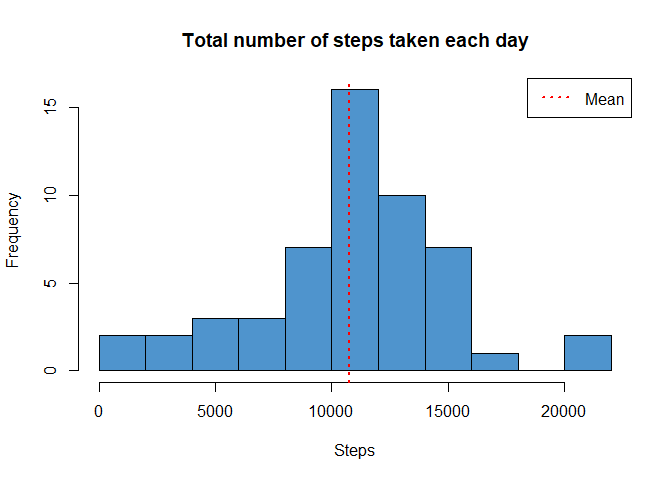
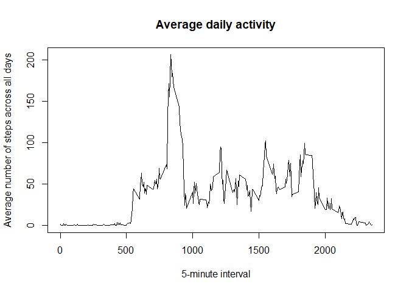
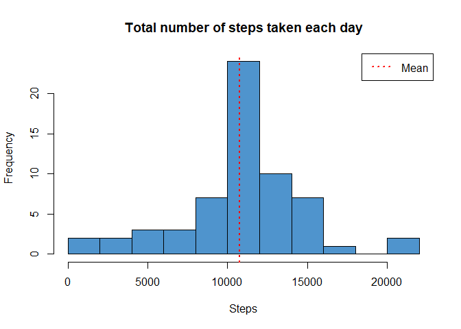
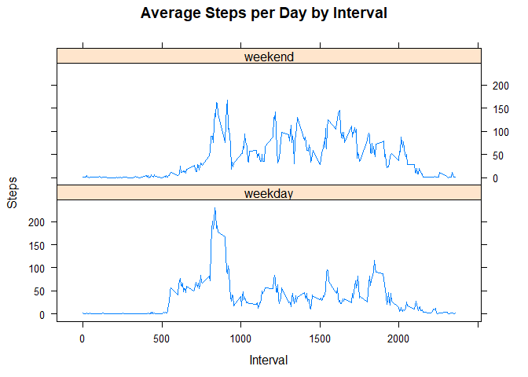

## Loading and preprocessing the data

```r
activity <- read.csv("activity.csv")

str(activity)
```

```
## 'data.frame':	17568 obs. of  3 variables:
##  $ steps   : int  NA NA NA NA NA NA NA NA NA NA ...
##  $ date    : Factor w/ 61 levels "2012-10-01","2012-10-02",..: 1 1 1 1 1 1 1 1 1 1 ...
##  $ interval: int  0 5 10 15 20 25 30 35 40 45 ...
```


## What is mean total number of steps taken per day?

Calculate the total number of steps taken per day.


```r
Totalsteps<-aggregate(steps ~ date,activity, sum)

hist(Totalsteps$steps,
     breaks=12,
     xlab="Steps",
     col="steelblue3",
     main = "Total number of steps taken each day")
abline(v=mean(Totalsteps$steps),lty=3, lwd=2, col="red")
legend(legend="Mean","topright",lty=3,lwd=2, col="red")
```

<!-- -->

Mean and median of the total number of steps taken per day. 


```r
Totalmean<-mean(Totalsteps$steps, na.rm = TRUE)
Totalmedian<-median(Totalsteps$steps, na.rm = TRUE)
```
Mean = **10766.19**;
Median = **10765**

## What is the average daily activity pattern?

```r
Averageday <- aggregate(steps ~interval, activity, mean )
plot(Averageday$interval,Averageday$steps,
     type = "l", 
     main = "Average daily activity", 
     ylab = "Average number of steps across all days", 
     xlab = "5-minute interval")
```

<!-- -->

5-minute interval, on average across all the days in the dataset that contains the maximum number of steps.


```r
Averageday$interval[which.max(Averageday$steps)]
```

```
## [1] 835
```


## Imputing missing values

The total number of missing values in the dataset.

```r
sum(is.na(activity$steps))
```

```
## [1] 2304
```

New dataset with the missing data filled in.
The strategy for filling in all of the missing values in the dataset was the mean for that 5-minute interval.


```r
New.activity<-activity
for(i in 1:nrow(New.activity)){
        if (is.na(New.activity[i,1])){
                New.activity[i,1]=Averageday$steps[which(
                        Averageday$interval==New.activity[i,3])]
        }

        
}

str(New.activity)
```

```
## 'data.frame':	17568 obs. of  3 variables:
##  $ steps   : num  1.717 0.3396 0.1321 0.1509 0.0755 ...
##  $ date    : Factor w/ 61 levels "2012-10-01","2012-10-02",..: 1 1 1 1 1 1 1 1 1 1 ...
##  $ interval: int  0 5 10 15 20 25 30 35 40 45 ...
```

Histogram of the total number of steps taken each day.


```r
New.Totalsteps<-aggregate(steps ~ date,New.activity, sum)

hist(New.Totalsteps$steps,
     breaks=12,
     xlab="Steps",
     col="steelblue3",
     main = "Total number of steps taken each day")
abline(v=mean(New.Totalsteps$steps),lty=3, lwd=2, col="red")
legend(legend="Mean","topright",lty=3,lwd=2, col="red")
```

<!-- -->


Mean and median of the total number of steps taken per day.


```r
New.Totalmean<-mean(New.Totalsteps$steps, na.rm = TRUE)
New.Totalmedian<-median(New.Totalsteps$steps, na.rm = TRUE)
```

Mean = **10766.19**;
Median = **10766.19**

Do these values differ from the estimates from the first part of the assignment?


```r
New.Totalmean - Totalmean
```

```
## [1] 0
```

```r
New.Totalmedian - Totalmedian
```

```
## [1] 1.188679
```

What is the impact of imputing missing data on the estimates of the total daily number of steps?

The missing data in this problem affected the median.

## Are there differences in activity patterns between weekdays and weekends?

Creation of a new factor variable in the dataset with two levels – “weekday” and “weekend” indicating whether a given date is a weekday or weekend day


```r
New.activity$week<-weekdays(as.Date(New.activity$date))
New.activity$dayType  <- ifelse(New.activity$week %in% c("Saturday", "Sunday"), "weekend", "weekday")
New.activity$dayType  <- as.factor(New.activity$dayType)
```

Panel plot containing a time series plot of the 5-minute interval and the average number of steps taken, averaged across all weekday days or weekend days.


```r
New.Averageday <- aggregate(steps ~interval+dayType, New.activity, mean )

library(lattice)

xyplot(New.Averageday$steps ~ New.Averageday$interval|New.Averageday$dayType,
       main="Average Steps per Day by Interval",
       xlab="Interval", 
       ylab="Steps",
       layout=c(1,2), 
       type="l")
```

<!-- -->

As can be seen in the plot there are some differences between the weekdays and weekends.
